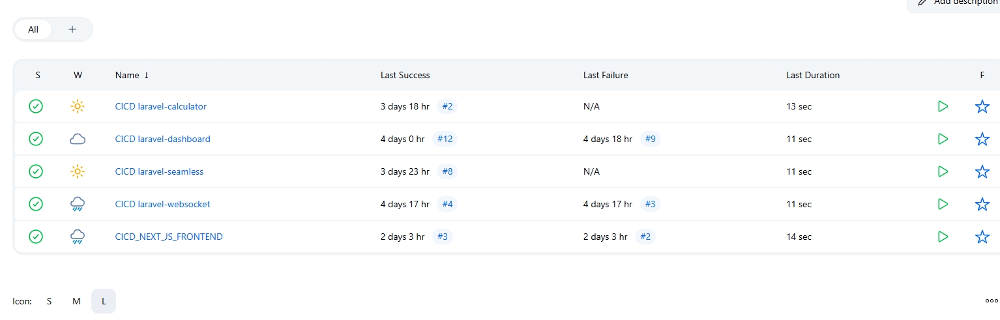

<!-- @format -->

# ⚙️ Ansible Provisioning for Full Laravel & Next.js Stack with MySQL Replication & Monitoring

[](https://www.ansible.com/)
[]()
[]()
[]()
[]()

---

## 📦 Overview

This Ansible setup automates the provisioning of a **secure, full-featured Laravel ecosystem** with MySQL replication, Next.js frontend, phpMyAdmin access, Nginx proxy, Jenkins, and Prometheus stack.

All deployments are **in private subnets**, orchestrated from the **Bastion Host**, which is pre-installed with Ansible.

---

## 🧭 Provisioning Flow Summary

### 🔹 Step 1: Gather System Facts

- Collected from all target hosts:
  - Bastion
  - Laravel (4 services)
  - MySQL Master & Slave
  - Frontend Next.js
  - Jenkins/Prometheus
  - Public Nginx Proxy

### 🔹 Step 2: MySQL Installation & Configuration

- Install MySQL server & client
- Configure master-slave replication
- Create users:
  - For Laravel access
  - For phpMyAdmin (from Bastion)
- Enable access via internal DNS

### 🔹 Step 3: Install phpMyAdmin

- Hosted on **Bastion Host**
- Multi-host support: connects to both Master & Slave MySQL
- Nginx enabled on Bastion to serve PHP apps

### 🔹 Step 4: Install Node.js & PM2

- Target:
  - Laravel WebSocket Server
  - Frontend Next.js apps

### 🔹 Step 5: Laravel App Deployment (4 Services)

- Using roles:
  - `laravel_dash_v2`
  - `laravel_ws`
  - `laravel_calc`
  - `laravel_seam`
- Configure `.env` via facts gathered
- Setup Supervisor & queue workers
- Special config for:
  - **Pusher/WebSocket**
  - **Job Queue via Supervisorctl**

### 🔹 Step 6: Deploy Next.js

- Environment setup
- Run build & start app
- Managed via PM2
- Backend interaction only with Laravel Dashboard & WebSocket

### 🔹 Step 7: Configure Nginx Proxy

- Public Nginx server reverse proxies:
  - `/` to Next.js (round robin)
  - `/api` to Laravel services
  - `/ws` to WebSocket

### 🔹 Step 8: Install Jenkins + Prometheus

- `jenkins_prometheus` EC2 handles:
  - Jenkins CI/CD
  - Prometheus (port `9090`)
  - Grafana (port `3000`)
  - Alertmanager (port `9093`)

---

---

## 🚨 Alertmanager Notification Channels

The monitoring system uses **Prometheus + Alertmanager**, with predefined alert rules for:

- Instance Down
- MySQL Replication Lag
- High CPU/RAM Usage
- Disk Usage Critical

### 🔔 Notification Channels:

| Channel     | Description                                                |
| ----------- | ---------------------------------------------------------- |
| 📧 Gmail    | Email alert for all severity levels                        |
| 💬 WhatsApp | Integrated via [CallMeBot](https://www.callmebot.com/) API |
| 💡 LINE     | Push notification via LINE Notify API                      |

### 🧰 Alertmanager Configuration Snippet

Here’s a simplified example of how `alertmanager.yml` is configured via Ansible for multiple channels:

````yaml
global:
  smtp_smarthost: 'smtp.gmail.com:587'
  smtp_from: 'your-alert@gmail.com'
  smtp_auth_username: 'your-alert@gmail.com'
  smtp_auth_password: 'your-app-password' # use App Password, not normal one
  smtp_require_tls: true

route:
  group_by: ['alertname']
  receiver: 'multi-channel'
  group_wait: 10s
  group_interval: 2m
  repeat_interval: 1h

receivers:
  - name: 'multi-channel'
    email_configs:
      - to: 'your-team@gmail.com'
    webhook_configs:
      - url: 'https://api.callmebot.com/whatsapp.php?phone=+628xxxx&text={{ .CommonAnnotations.summary }}&apikey=yourapikey'
        send_resolved: true
      - url: 'https://notify-api.line.me/api/notify'
        http_config:
          bearer_token: 'your-line-notify-token'
        send_resolved: true


## 🔍 Monitoring & Exporters

Install using Ansible playbooks:

```bash
ansible-playbook -i inventories/production/all_host.ini playbook/full_installation/install_node_exporter.yaml
ansible-playbook -i inventories/production/all_host.ini playbook/full_installation/install_prometheus.yaml


````

## 🔧 Jenkins CI/CD Dashboard

<p align="center">
  
</p>

---

## 📊 Grafana Dashboards for Laravel & MySQL

<p align="center">
  
</p>

---

## 📡 Prometheus Target Status

<p align="center">
  
</p>

---

## 🚨 Alertmanager Notifications

### 🔔 Email via Gmail

<p align="center">
  
</p>

---

### 💬 WhatsApp Notification

<p align="center">
  
</p>

---

### 📱 LINE Notification

<p align="center">
  
</p>
