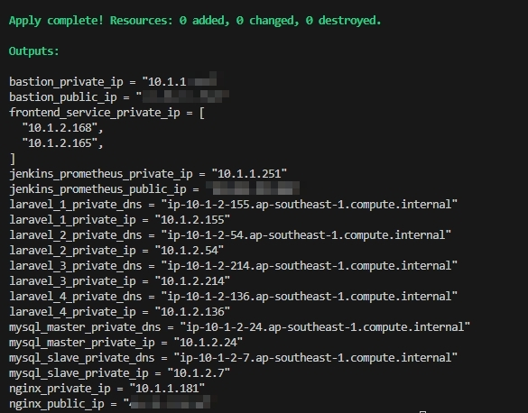

<!-- @format -->

# 🌐 Terraform AWS Infrastructure

[](https://www.terraform.io/)
[](https://aws.amazon.com/)
[](LICENSE)

> 🚀 This Terraform module provisions a fully-isolated and production-ready AWS infrastructure for Laravel + Next.js applications, complete with networking, security, public/private subnets, and static IP allocation.

---

## 🧩 Architecture Highlights

```
AWS VPC
├── Public Subnet
│   ├── Bastion Host (SSH Gateway)
│   ├── Nginx Reverse Proxy
│   └── Jenkins / Prometheus / Alertmanager
│
├── Private Subnet
│   ├── Laravel Apps (Dashboard, WebSocket, Calculator, Seamless)
│   ├── Frontend Next.js (x2 - reverse proxied)
│   └── MySQL Master + Slave
```

---

## 🔧 Features

- 🏗 **Full VPC Module**: Internet Gateway, NAT Gateway, Public & Private Route Tables
- 🔐 **Isolated Subnets**: EC2 instances are logically separated between private and public zones
- 📡 **Elastic IPs**: Static IP assignment via AWS EIP for critical services (Bastion, Jenkins, Nginx)
- 🛡 **Granular Security Groups**: Custom access rules for each tier (App, DB, Proxy, CI/CD)
- 📤 **Automatic Outputs**: Access critical values such as `bastion_public_ip`, `laravel_private_ip`, `mysql_master_dns`, and more

---

## 📁 Project Structure

```bash
terraform/
├── main.tf                   # Root module
├── variables.tf              # Input variable definitions
├── terraform.tfvars          # Actual values for the variables
├── outputs.tf                # Outputs from the infra
├── providers.tf              # AWS provider config
└── modules/
    ├── vpc/                  # VPC, subnets, NAT, IGW, routes
    ├── ec2/                  # EC2 definitions for app, frontend, bastion, jenkins
    └── security_groups/      # Custom SGs for each role
```

---

## 🚀 Quick Start

```bash
# 1. Initialize Terraform
terraform init

# 2. Review the plan
terraform plan

# 3. Apply infrastructure
terraform apply -auto-approve
```

> ⚠️ Don’t forget to set your AWS credentials in `terraform.tfvars` or via environment variables.

---

## ✅ Terraform Apply Result

Here is the proof of successful Terraform provisioning:



## 🌍 Output Example

After `terraform apply`, Terraform will output critical values:

```hcl
bastion_public_ip        = "13.229.XX.XX"
nginx_public_ip          = "52.221.XX.XX"
jenkins_prometheus_ip    = "18.140.XX.XX"
laravel_1_private_ip     = "10.1.2.xx"
mysql_master_private_dns = "ip-10-1-2-xx.ap-southeast-1.compute.internal"
```

These are useful for SSH, proxy setup, and monitoring access.

---

## 📌 Requirements

| Name         | Version        |
| ------------ | -------------- |
| Terraform    | >= 1.2.0       |
| AWS Provider | ~> 4.16        |
| AWS Account  | With EC2 & VPC |

---

## ✅ Best Practices

- Use **remote backend (e.g. S3 + DynamoDB)** for state locking in team environments
- Implement **Terraform Cloud / CI pipeline** for changes
- Parameterize reusable modules for future workloads

---

## 📚 References

- [Terraform AWS Provider Docs](https://registry.terraform.io/providers/hashicorp/aws/latest/docs)
- [VPC Best Practices](https://docs.aws.amazon.com/vpc/latest/userguide/VPC_Scenario2.html)
- [Terraform Modules Guide](https://developer.hashicorp.com/terraform/language/modules)

---

## 📄 License

MIT License © 2025 — XrerXrerX
