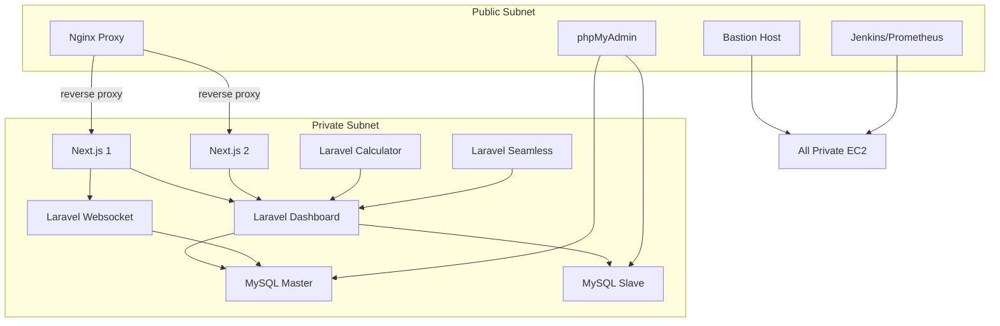

<!-- @format -->

# 🛡️ Secure & Optimized AWS Infrastructure with Terraform: Private Subnet Isolation, NAT Routing, and Modular DevOps Stack

[](https://www.terraform.io/)
[](https://aws.amazon.com/)
[]()
[]()
[](LICENSE)

> ⚙️ This Terraform-based infrastructure enforces **private subnet isolation**, configures **secure NAT routing**, and applies **granular security groups** to ensure optimized and safe communication across tiers of Laravel and Next.js workloads.

## ✨ Overview

This project provisions and configures a **production-grade infrastructure** on AWS using **Terraform**, with automated deployment pipelines via **Jenkins**, configuration management via **Ansible**, and a full monitoring stack using **Prometheus**, **Grafana**, and **Alertmanager**.

The infrastructure is designed with **separated public and private subnets** and includes the following key components:

- 4 Laravel Apps in private subnet (dashboard, websocket, calculator, seamless)
- MySQL Master-Slave replication cluster (private subnet)
- 2 Next.js frontend apps in private subnet with Nginx reverse proxy (public subnet)
- Bastion host and phpMyAdmin (public subnet)
- Jenkins, Prometheus, Grafana, and Alertmanager (public subnet)

---

## 📊 Architecture Diagram

> _Diagram will visually depict the flow between components. Laravel dashboard acts as the hub for frontend, websocket, calculator, and seamless apps._

---

## 🚀 Infrastructure Provisioning with Terraform

## 🔁 Arsitektur Interaksi



### Modules:

- Full VPC Module (Internet Gateway, NAT Gateway, and Route Tables)
- EC2 Instances are isolated between Private and Public Subnets
- Static IP mapping using Elastic IPs
- Granular Security Group rules for each service
- Automatic outputs (e.g., `bastion_public_ip`, `laravel_private_ip`, etc.)

## 📌 Fitur Terraform

- Full VPC Module (Internet Gateway, NAT Gateway, Route Tables)
- EC2 Instance isolate between Subnet Private and Public
- Pemetaan IP statik via Elastic IP
- Security Group dengan aturan granular per layanan
- Output otomatis (bastion_public_ip, laravel_private_ip, dsb.)

### EC2 Roles:

- `prod_ec2_laravel_dashboard`
- `prod_ec2_laravel_websocket`
- `prod_ec2_laravel_calculator`
- `prod_ec2_laravel_seamless`
- `prod_ec2_mysql_master`, `prod_ec2_mysql_slave`
- `prod_ec2_frontend_service_1`, `frontend_service_2`
- `prod_ec2_nginx_proxy`
- `prod_ec2_jenkins_prometheus`
- `prod_ec2_bastion_host`

---

## 🚧 Configuration Management with Ansible in other folder check it out !

Ansible is bootstrapped on the bastion host to manage:

- Laravel application dependencies
- Web server configurations
- Database replication setup
- Jenkins Installation
- Monitoring setup (grafana , prometheus , node exporter, alert manager)

> The `bastion` instance is pre-provisioned with Ansible during user-data execution.

---

## ♻️ CI/CD with Jenkins

The `jenkins_prometheus` instance hosts Jenkins, which is accessible from trusted IPs only.

### Pipeline Features:

- Auto build & deploy Laravel and Frontend apps
- Webhook integration with GitHub/GitLab
- Environment-based deployment using tags/branches

---

## 🔍 Monitoring Stack

### Prometheus + Node Exporter

- EC2 metrics (CPU, memory, network)
- Custom application metrics (via exporters)

### Grafana

- Dashboards for Laravel, MySQL, and EC2s

### Alertmanager

- Custom alert rules for:

  - MySQL replication lag
  - Instance down
  - High memory/CPU usage

Alerts are routed via Slack/Email based on severity.

---

## 🌐 Public IPs (via EIP)

- Bastion: `bastion_public_ip`
- Jenkins/Prometheus: `jenkins_prometheus_public_ip`
- Nginx Proxy: `nginx_public_ip`

## 📦 Deployment

```bash
# Initialize
terraform init

# Validate & plan
terraform plan -out=tfplan

# Apply
terraform apply tfplan
```

---

## 💡 Notes

- Frontend (Next.js) communicates only with Laravel Dashboard & Laravel Websocket
- Laravel Calculator & Seamless are private, and communicate only with Laravel Dashboard
- All Laravel & MySQL servers are **private subnet only**

---

## 📊 Monitoring & Alerting

- **Prometheus Node Exporter** untuk semua EC2
- **Grafana**: Dashboard resource (CPU, RAM, Disk, Uptime)
- **AlertManager**: Notifikasi ke Slack/Telegram/email
- Exporter aktif: port `9100`, `9090`, `3000`, `8080`

---

## 🔗 References

- [Terraform AWS Provider](https://registry.terraform.io/providers/hashicorp/aws/latest/docs)
- [Ansible Playbooks Best Practices](https://docs.ansible.com/ansible/latest/user_guide/playbooks_best_practices.html)
- [Prometheus Documentation](https://prometheus.io/docs/introduction/overview/)
- [Grafana Dashboards](https://grafana.com/grafana/dashboards/)
- [Jenkins Pipeline](https://www.jenkins.io/doc/book/pipeline/)

---

##
