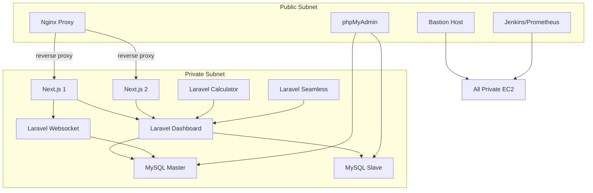

<!-- @format -->

# 🛡️ Secure & Optimized AWS Infrastructure with Terraform: Private Subnet Isolation, NAT Routing, and Modular DevOps Stack

[](https://www.terraform.io/)
[](https://aws.amazon.com/)
[]()
[]()
[](LICENSE)

> ⚙️ This Terraform-based infrastructure enforces **private subnet isolation**, configures **secure NAT routing**, and applies **granular security groups** to ensure optimized and safe communication across tiers of Laravel and Next.js workloads.

## ✨ Overview

This project provisions and configures a **production-grade infrastructure** on AWS using **Terraform**, with automated deployment pipelines via **Jenkins**, configuration management via **Ansible**, and a full monitoring stack using **Prometheus**, **Grafana**, and **Alertmanager**.

The infrastructure is designed with **separated public and private subnets** and includes the following key components:

- 4 Laravel Apps in private subnet (dashboard, websocket, calculator, seamless)
- MySQL Master-Slave replication cluster (private subnet)
- 2 Next.js frontend apps in private subnet with Nginx reverse proxy (public subnet)
- Bastion host and phpMyAdmin (public subnet)
- Jenkins, Prometheus, Grafana, and Alertmanager (public subnet)

---

## 📊 Architecture Diagram

> _Diagram will visually depict the flow between components. Laravel dashboard acts as the hub for frontend, websocket, calculator, and seamless apps._

---

## 🚀 Infrastructure Provisioning with Terraform

## 🔁 Arsitektur Interaksi



## 🚀 Infrastructure Provisioning with Terraform

### ✅ Key Features

- 🏗 Full VPC Module (Internet Gateway, NAT Gateway, Route Tables)
- 🔐 EC2 instances isolated between private and public subnets
- 📡 Static IPs via Elastic IP
- 🔒 Granular Security Group rules per service
- 📤 Automatic outputs (e.g. `bastion_public_ip`, `laravel_private_ip`, etc.)

### EC2 Roles:

- `prod_ec2_laravel_dashboard`
- `prod_ec2_laravel_websocket`
- `prod_ec2_laravel_calculator`
- `prod_ec2_laravel_seamless`
- `prod_ec2_mysql_master`, `prod_ec2_mysql_slave`
- `prod_ec2_frontend_service_1`, `frontend_service_2`
- `prod_ec2_nginx_proxy`
- `prod_ec2_jenkins_prometheus`
- `prod_ec2_bastion_host`

---

## ⚙️ Configuration Management with Ansible

All EC2 instances are provisioned automatically using **Ansible** from the Bastion Host.

### Provisioned with:

- `.env` environment configs
- Nginx + PHP-FPM setup for Laravel
- Database replication (Master-Slave)
- Node Exporter installed for all EC2
- Jenkins setup with webhook support
- Prometheus & Alertmanager deployment
- Grafana + preloaded dashboards

📁 Check `ansible/` directory in this repository for details.

---

## ♻️ CI/CD with Jenkins

Jenkins is deployed on a public subnet with strict access via security group.

### Supports:

- Auto build & deploy Laravel and Next.js with ansible
- Webhook triggers via GitHub
- Branch/tag-based deployment
- SSH jump via Bastion for private EC2 delivery

---

## 📈 Monitoring Stack

### 🔍 Prometheus + Node Exporter

- CPU, Memory, Disk for all EC2
- Laravel + MySQL metrics via exporters

### 📊 Grafana

- Prebuilt dashboards
- Visualizes app uptime, DB replication, usage

### 🔔 Alertmanager

- Configurable alerts for:
  - High CPU/memory
  - Service downtime
  - DB replication lag

> Alerts routed via line, whatsapp, or Email.

---

## 🌐 Public IPs (via EIP)

- Bastion: `bastion_public_ip`
- Jenkins/Prometheus: `jenkins_prometheus_public_ip`
- Nginx Proxy: `nginx_public_ip`

## 📦 Deployment

```bash
# Initialize
terraform init

# Validate & plan
terraform plan -out=tfplan

# Apply
terraform apply tfplan
```

---

## 🔐 Private App Communication Rules

- Next.js only communicates with Laravel Dashboard and Websocket
- Laravel Calculator & Seamless only talk to Laravel Dashboard
- MySQL is only accessible from Laravel apps (private subnet)
- All communication from frontend is reverse-proxied via public Nginx

---

## 📊 Monitoring & Alerting

- **Prometheus Node Exporter** untuk semua EC2
- **Grafana**: Dashboard resource (CPU, RAM, Disk, Uptime)
- **AlertManager**: Notifikasi ke Slack/Telegram/email
- Exporter aktif: port `9100`, `9090`, `3000`, `8080`

---

## 🔗 References

- [Terraform AWS Provider](https://registry.terraform.io/providers/hashicorp/aws/latest/docs)
- [Ansible Playbooks Best Practices](https://docs.ansible.com/ansible/latest/user_guide/playbooks_best_practices.html)
- [Prometheus Documentation](https://prometheus.io/docs/introduction/overview/)
- [Grafana Dashboards](https://grafana.com/grafana/dashboards/)
- [Jenkins Pipeline](https://www.jenkins.io/doc/book/pipeline/)

---

##
